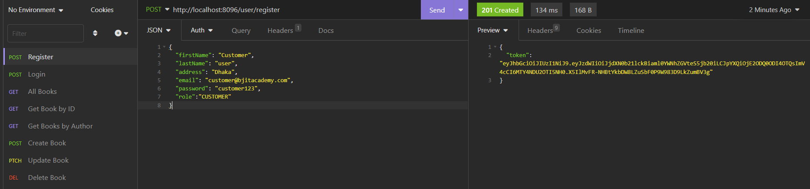
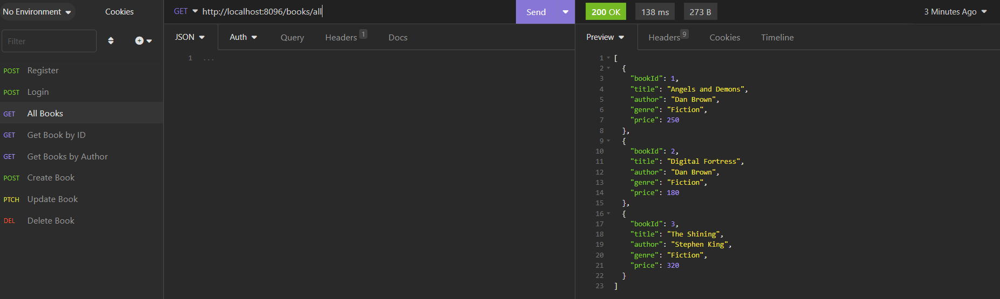
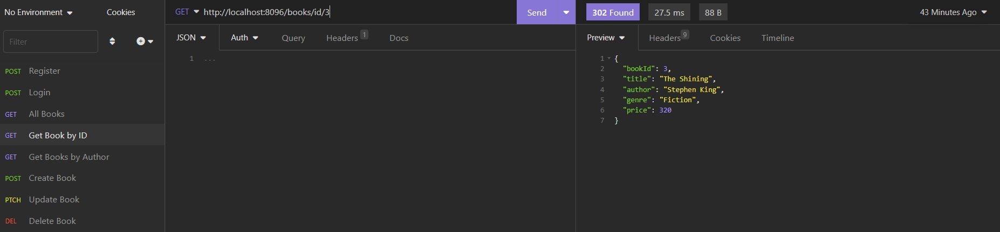
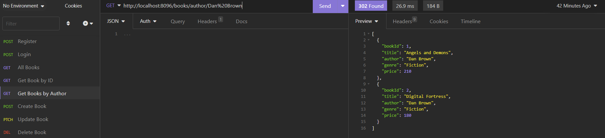
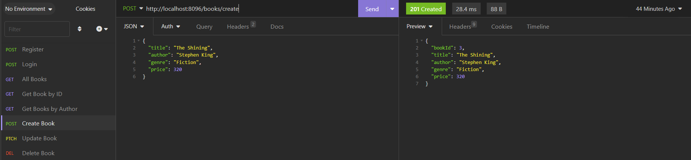
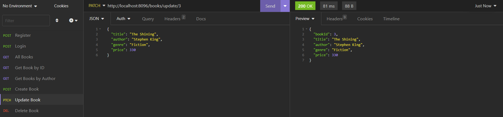
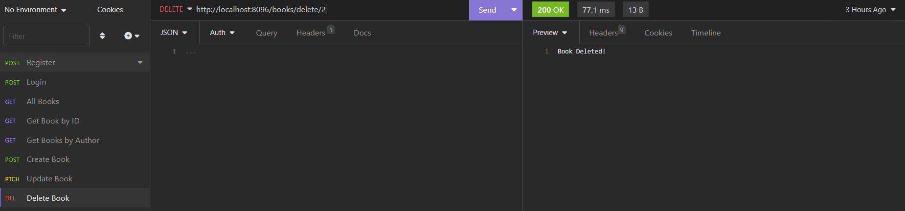

# Online Book Library Application

This project demonstrates the implementation of microservice using Spring Boot, Netflix Eureka Client and Feign Client.

## Features

* User registration.
* See all books.
* Book order with quantity.
* Order books.
* User payment.

## Technologies

* Spring Boot
* JPA
* Gradle
* MySQL
* Netflix Eureka
* Feign Client

## Getting Started

To get started with this project, you will need to have the following installed on your local machine:

* JDK 17+
* Gradle
* MySQL driver

To build and run the project, follow these steps:

* Login to mySQL driver with user "root" and password "root"
* Add database "project_db" to mySQL
* Set the path of configRepo in application.properties in configServer
* Run the project

The application will run at http://localhost:9090

## Functions (Links and Mappings)

Post mapping (username, email and password) for registration: http://localhost:8096/user/register

Get mapping to view all books: http://localhost:8096/books/all

Get mapping to view details of a book: http://localhost:8096/books/id/{id}

Get mapping to view all books by an author: http://localhost:8096/books/author/{author}

Post mapping (title, author, genre and price)  to create a book: http://localhost:8096/books/create

Patch mapping to update a book: http://localhost:8096/books/update/{id}

Delete mapping to delete a book: http://localhost:8096/books/delete/{id}

